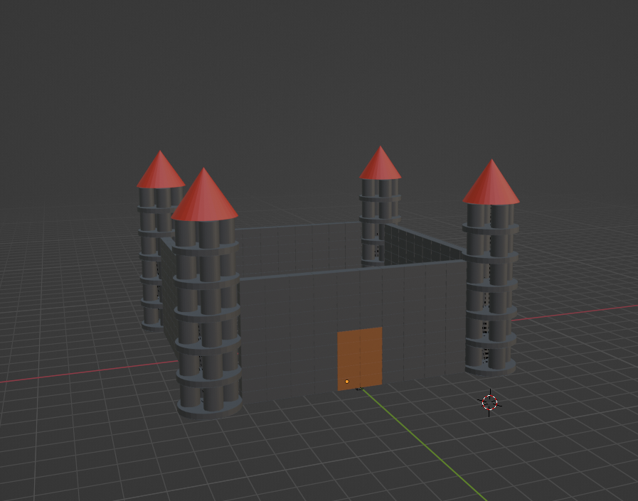
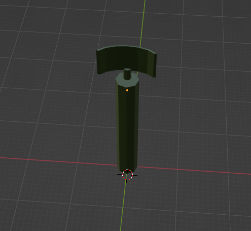
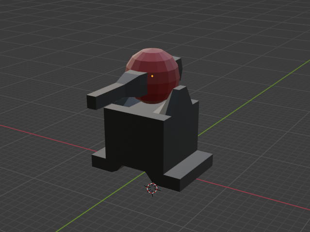
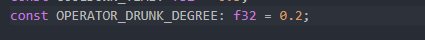
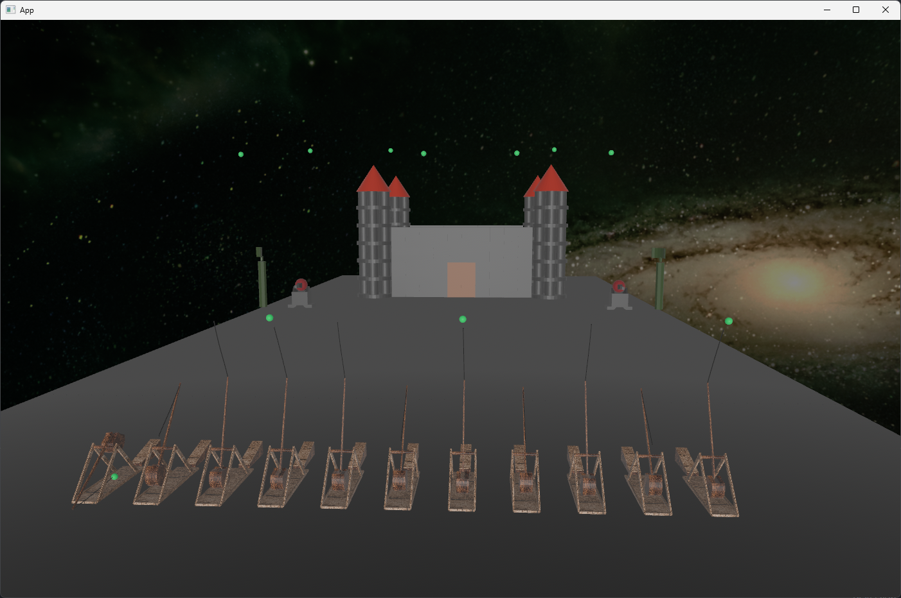

# Project Siege
## Part 1: Trebuchet
###  What if we need a trebuchet?
Why? Well, maybe there is a fortress that needs to be destroyed. Or just for fun.  
Let's try. Let's try to stay closer to reality (well, we'll try at least), and then we'll see :))  

First, let's take some information from Wikipedia [Trebuchet](https://en.wikipedia.org/wiki/Trebuchet)  

Then we'll draw this thing in Blender.  

  

Well, then, we'll take a little bit of Bevy, a little bit of Avian3d and a little bit of our brains (just a little bit ;)).  

## Part 2: Fortress
We'll just build it out of bricks (we need it to fall apart on impact)    

## Part 3: AntiTrebuchetDefenseSystem :)
A defenseless fortress is a very pitiful thing. So we need a radar to detect enemy shells and a turret to shoot them down.  
_Masterfully drawn, huh? :)_  

 
  

_I must note that the percentage of hits on enemy shells depends on how drunk the operator is. :)_  

<a href="https://xenon615.github.io/siege/" target="_blank">Demo(very slow at the moment)</a>  

## Credits
__Plong__, for very usefull thing which helped me a lot  
[Bevy Pan/Orbit Camera](https://github.com/Plonq/bevy_panorbit_camera)

## Disclaimer
I sincerely regret that I do not indicate any license, it is not out of malicious intent, I just have not yet figured out which one to choose, I regret it.

