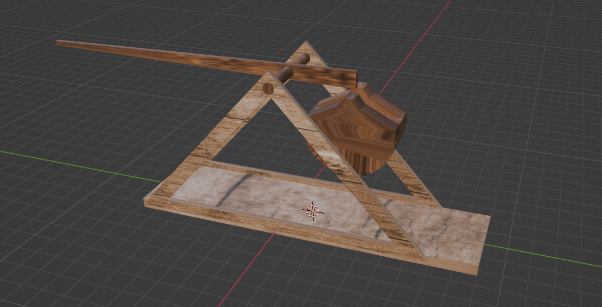

# Project Siege
## Part 1: Trebuchet
###  What if we need a trebuchet?
Why? Well, maybe there is a fortress that needs to be destroyed. Or just for fun.  
Let's try. Let's try to stay closer to reality (well, we'll try at least), and then we'll see :))  

First, let's take some information from Wikipedia [Trebuchet](https://en.wikipedia.org/wiki/Trebuchet)  

Then we'll draw this thing in Blender.  

  

Well, then, we'll take a little bit of Bevy, a little bit of Avian3d and a little bit of our brains (just a little bit).

